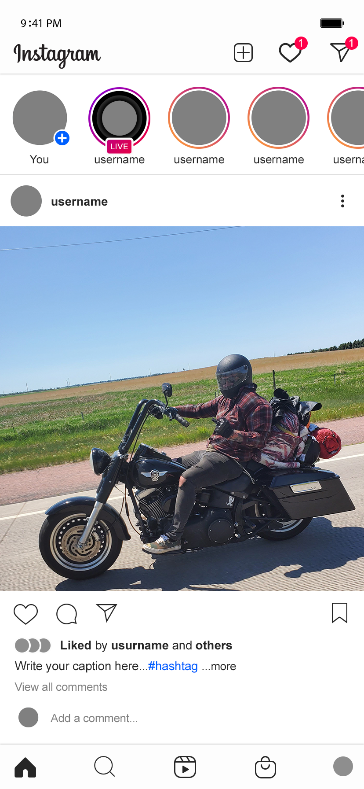

# img-items

[](https://packagist.org/packages/kodie/img-items)
[](https://packagist.org/packages/kodie/img-items)
[](license.md)

Finds individual items inside an image and gets their size/coordinates. A PHP port of the [img-items](https://github.com/kodie/img-items) Node module.

## Example

| Source                       | Result                              |
:-----------------------------:|:------------------------------------:
|  |  |

```php
<?php
require_once('vendor/autoload.php');

$contents = file_get_contents('assets/feed-example.png');
$img = imagecreatefromstring($contents);
$items = img_items($img);

foreach($items as $item) {
  for ($y = $item['top']; $y < $item['bottom'] + 1; $y++) {
    for ($x = $item['left']; $x < $item['right'] + 1; $x++) {
      imagesetpixel($img, $x, $y, imagecolorallocate($img, 255, 0, 0));
    }
  }
}

imagepng($img, 'assets/feed-example-filled.png', 0);
imagedestroy($img);
?>
```

## Caveat

The larger the image and/or the more background colors defined to compare against, the slower the module will run. There are more than likely some things that could be approved upon to make it more efficient but it does work as is.

## Installation

```shell
composer require kodie/img-items
```

## Usage

`img_items(image, options)`

```php
<?php
require_once('vendor/autoload.php');

$items = img_items('my-image.jpg', array(
  'background'           => 0,
  'background_threshold' => 5,
  'gap_threshold'        => 5,
  'size_threshold'       => 5
));
?>
```

### Parameters

#### `$image`

The image to scan for items. Accepts a file path to an image, a [gd Image Resource](https://www.php.net/manual/en/image.resources.php), or a [GdImage Instance](https://www.php.net/manual/en/class.gdimage.php).

#### `$options`

An array with options you can set to tweak how items are found:

  * `background` (Default: `0`) - The color(s) that should be considered the background of the image. Accepts any string with a color value that the [color component factory](https://github.com/spatie/color#factoryfromstring-color) can convert to a color (examples: `#FFFFFF`, `rgb(255, 0, 0)`, `hsl(240, 100%, 50%)`), an array of those color strings, an integer set to `0` to use the top left pixel color, an integer set to `-1` to set the background color to either black or white depending on the average luminance of the image, or an integer from `1` to `10` to use that number of primary colors from the image. *(Keep in mind that the more colors that are defined here, the slower the module will run.)*

  * `background_threshold` (Default: `5`) - An integer from `0` to `100` defining how close a color can be to the background color (using the [CIE76 Color Difference Formula](https://en.wikipedia.org/wiki/Color_difference#CIE76)) for it to be considered part of the background. `0` being an exact match.

  * `gap_threshold` (Default: `5`) - An integer defining how many pixels of background color before an item is considered it's own item.

  * `gap_y_threshold` (Default: `null`) - The same as `gap_threshold` but only on the `Y` axis. (Setting to `null` will fallback to `gap_threshold`)

  * `gap_x_threshold` (Default: `null`) - The same as `gap_threshold` but only on the `X` axis. (Setting to `null` will fallback to `gap_threshold`)

  * `size_threshold` (Default: `5`) - An integer defining how many pixels wide and high an item should be to make the cut. If an item has a width or height lower than this value it will be filtered out of the results.

  * `height_threshold` (Default: `null`) - The same as `size_threshold` but only for the item's height. (Setting to `null` will fallback to `size_threshold`)

  * `width_threshold` (Default: `null`) - The same as `size_threshold` but only for the item's width. (Setting to `null` will fallback to `size_threshold`)

### Example Response

```text
Array
(
  [0] => Array
    (
      [left] => 728
      [top] => 42
      [right] => 782
      [bottom] => 62
      [width] => 55
      [height] => 21
    )
  [1] => Array
    (
      [left] => 47
      [top] => 44
      [right] => 58
      [bottom] => 61
      [width] => 12
      [height] => 18
    )
  [2] => Array
    (
      [left] => 66
      [top] => 44
      [right] => 93
      [bottom] => 61
      [width] => 28
      [height] => 18
    )
)
```

## License
MIT. See the [license.md file](license.md) for more info.

[Jimp]: https://www.npmjs.com/package/jimp
